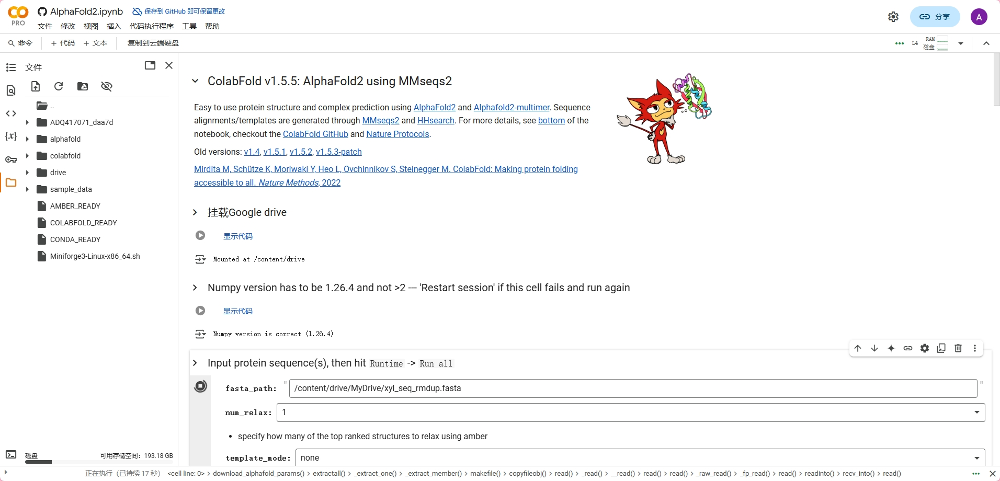

# Alphafold 批量预测脚本

## 项目简介
本脚本基于ColabFold实现蛋白质结构的批量预测，支持自动处理FASTA文件、Google Drive集成、多序列处理等功能。

## 功能特性
- ✅ 自动解析FASTA文件批量处理
- ✅ 智能跳过已处理序列
- ✅ Google Drive自动同步结果
- ✅ 支持自定义模板和参数配置

## 快速开始
### 环境要求
- Python 3.7+
- Google Colab 环境

### 安装步骤

=======
点击[colab](https://colab.research.google.com/github/liuwang2000/colabScript/blob/main/AlphaFold2.ipynb)直接运行，如果有问题就重启执行

### 使用指南
1. 将FASTA文件放入Google Drive
2. 修改脚本中的fasta_path路径
3. 配置预测参数（详见参数说明）
4. 运行完整脚本

## 参数配置
| 参数 | 默认值 | 说明 |
|------|--------|-----|
| num_relax | 1 | 结构优化次数 |
| template_mode | none | 模板使用模式 |

## 常见问题
### 如何处理超长序列？
脚本会自动跳过长度超过2500的序列，并记录在skipped_sequences.txt

### 结果文件存储在哪里？
预测结果会自动打包为zip文件并同步到Google Drive的MyDrive目录

## 许可证
MIT License

---
<<<<<<< HEAD
*温馨提示：建议在Google Colab Pro环境下运行以获得更好性能*
=======
*温馨提示：建议在Google Colab Pro环境下运行以获得更好性能*
>>>>>>> 7204aa607f74962e3912c21bf8888e6e4026bb0d
